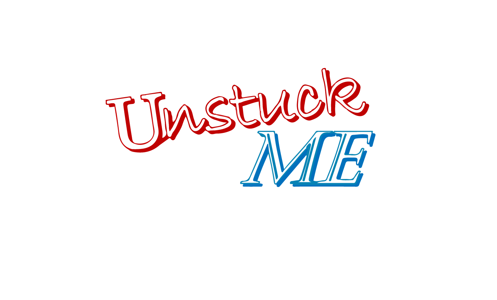

# 

#### *Unified Network for Student, Teacher, and University Communication of Knowledge for a Meaningful Education*  
A peer-to-peer mentoring program, connecting those who are the most willing to give their help to, to those most in need of it. 

##Problem Statement
Currently there is no reliable way of connecting students with the help they need for the classes they have. Similarly, many students want to give back and share some of the knowledge they have acquired. With no formalized system for doing so it makes this process very difficult; Unstuck ME is the solution to this problem. We would like to write a desktop application that would allow users quick, easy access to tutors that are willing to help.

##Usage
UnstuckME is a [MySQL](https://en.wikipedia.org/wiki/MySQL) Database, [WCF](https://en.wikipedia.org/wiki/Windows_Communication_Foundation) Server, and [WPF](https://en.wikipedia.org/wiki/Windows_Presentation_Foundation) Client dependent interfacing program. Please download and ServerSetup.exe and follow the on-screen setup, configuring it for your provided system. Then connect to or setup up your MySQL database using the provided '.sql' creation scripts. Finally, download the client application and connect it using the onscreen setup menu to connect to your configured WCF server and SQL database respectively.

- *Server Setup*
- *Database Setup*
- *Client Connection*

##Technologies
[C#](https://en.wikipedia.org/wiki/C_Sharp_(programming_language), [WCF](https://en.wikipedia.org/wiki/Windows_Communication_Foundation), [WPF](https://en.wikipedia.org/wiki/Windows_Presentation_Foundation), and [MySQL](https://en.wikipedia.org/wiki/MySQL)

##Credit, Inspiration, ALternatives
Unstuck ME was conceived while brainstorming for an idea for a Junior project for the 2016-17 school year at [Oregon Institute of Technology](http://www.oit.edu/). The developers of this program realized some students may not be able to visit a tutoring center during tutoring hours, and there are not many services that handle tutoring of advanced subjects over an internet connection. Unstuck ME will allow students access to online tutors for advanced subjects whenever they want.

##Team

 | |  | 
---|---|---|---
[Ryan Bell](https://github.com/RyanWBell) | [Arthur Clark](https://github.com/Clarkmeister) | [Matthew Cole](https://github.com/colematthew4) | [Kyronn Morgan](https://github.com/kmorgan24)

##Legal Notice
The UnstuckMe team make no warranties or representation of any kind concerning the accuracy or suitability of the information contained in this document for any purpose. All such information is provided “as is” and with specific disclaimer of any warranties of merchantability, fitness for purpose, title and/or non-infringement. In no event shall the Inverse Sprinters or its members be liable for any direct, indirect, or consequential damages resulting from the information provided in this document. This exclusion and limitation only applies to the contrary in any written license or subscription agreement from the UnstuckMe team in respect to this document or references.

__copyright ©2016-2017 The UnstuckMe team. All Rights Reserved__  
The copyright on all materials provided in these documents in held by the UnstuckMe team or by the original creators of the material. Except as stated herein, none of the material may be copied, reproduced, distributed, republished, translated, displayed, posted, communicated to the public by telecommunication or transmitted in any form by any means, including, but not limited to, electronic, mechanical, photocopying, recording, or otherwise, without the prior written permission of the copyright holder. Permission is granted to display copy and distribute the materials in this document for personal, noncommercial use provided no modifications are made to the materials and all copyright and other proprietary notices contained in the materials are retained. This permission terminates automatically if you breach any of these terms or conditions. Upon termination, any printed materials must be immediately destroyed. Any unauthorized use of any material contained in this document may violate copyright laws, trademark laws, the laws of privacy and publicity, and communications regulations and statutes. All rights, titles and interest not expressly granted are reserved.
